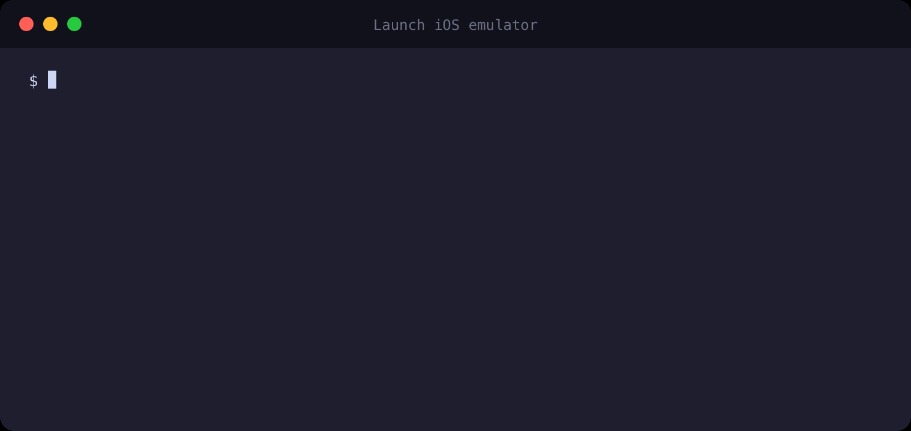

# >_ emulatorsh📱

Interactive terminal UI to **list, create, and launch** Android Virtual Devices and iOS Simulators. The command is **`emulatorsh`**:, from the shell.



Pick a platform, pick a device, and boom! You have your emulator up and running. The Emulator process starts **detached** so you can safely close the terminal if you wish. You're missing an Android SDK? No problem, you can do it right from the console! On Android you can also install system images and create new AVDs without opening Android Studio. There's no typing, no need to copy or remember PIDs or device names, the console is interactive. You simply navigate with your keyboard. Yup... I know, I'm excited too!

Teal `>` is the cursor. Green is **running** or **already installed**. On the platform list, `[running: 1/3]` is green when any device is up and gray when the count is `0`. Purple is a create/install action. Long lists split into **two columns** and paginate (`1/2 ↓ more`).

Licensed under [MIT](./LICENSE).

## Why

I got tired of opening Android Studio just to boot a Pixel.

Creating an AVD meant clicking through Device Manager, waiting on a system image, then discovering the hardware keyboard was off — so every login screen, every text field, I was poking at a fake on-screen keyboard. Turning `hw.keyboard=yes` meant hunting `config.ini` by hand. Doing that once is annoying. Doing it every time I needed a clean API level or a Wear device was a waste of an afternoon.

The Android Studio meanwhile kept changing how emulators launch. Sometimes the window is its own process. Sometimes it boots *inside* the IDE and I still don't fully know why — a setting, a toolbar button, a new Device Manager. I just wanted a device running so I could run tests, not debug the IDE.

iOS is not innocent either. `xcrun simctl` works, if you enjoy UDIDs. I was already in a terminal. I did not want to leave it.

So I wrapped the tools I already had — `emulator`, `avdmanager`, `sdkmanager`, `simctl` — in a single interactive keyboard UI. Pick a platform, pick a device, it starts detached so closing the terminal does not kill the emulator. New Android devices get a hardware keyboard without me opening an ini file. Running devices are marked so I do not boot a second copy by mistake.

This is the tool I wished I had on the days I lost an hour to Device Manager. If you have lived that, it is for you too.

No runtime npm dependencies. It shells out to the SDK and Xcode on your machine.

## What it does

1. Asks **Android**, **iOS**, or **watchOS**, each with `[running: n/total]` (green if any are up, gray if none).
2. **iOS** / **watchOS** — lists available simulators from `xcrun simctl` for that runtime. Booted devices are marked green `[running]`. Selecting one boots it and opens the Simulator app.
3. **Android** — lists AVDs from `emulator -list-avds`. Running AVDs are marked green `[running]`. Selecting one starts it detached. The last row is purple **Create new device**.
4. On a device list, **`c`** closes the highlighted running device: **Back** returns to the list; **Suspend** or **Terminate** runs the command and exits. Android **Suspend** is a graceful `adb emu kill` so Quick Boot can save a snapshot (next start is not a cold boot). **Terminate** force-kills the emulator and deletes that AVD’s Quick Boot snapshots so the next start is a cold boot — installed apps and userdata stay; it is not a wipe. iOS and watchOS only offer **Suspend** (`simctl shutdown` — it keeps the simulator disk, like a soft shutdown). In `--simulate`, that updates `demo.db` and closes the fake window if it is still open.

### Create a new Android device

1. Form factor: **Mobile Phone** or **Wear**.
2. Installed system image (or purple **Install new SDK**).
3. Device profile, shown as `Pixel_9_Pro_API_36` for the selected SDK. Already-created copies show `[installed: n]`. A `_2` / `_3` suffix is added only when creating, if that name is already taken.
4. Creates the AVD with `avdmanager`, enables `hw.keyboard=yes`, and starts it.

If no Wear or phone system image is installed, the SDK list shows orange `No SDK installed` plus **Install new SDK**.

Installing an SDK skips the SDK list and opens the device list for that image. Escape from devices returns to the SDK list with the new image selected. Selecting an already-installed SDK in the install list does nothing (returns to the list).

## Install

```bash
npm install -g emulatorsh
emulatorsh
```

Requires **Node.js 18+**. But let's be real, use **Node.js 22.5+** don't be a dino! 🦖

A global install only puts `emulatorsh` on your PATH. No install scripts, no runtime npm dependencies, nothing phones home — it shells out to the Android / Xcode tools already on your machine. Tagged releases on the [npm page](https://www.npmjs.com/package/emulatorsh) show a Provenance check: that tarball was built from this repo on GitHub Actions.

## Environment

The CLI does not install Android Studio or Xcode. It shells out to tools that must already be on the machine.

### Android

Set one of these (first existing directory wins):

| Variable | Role |
| --- | --- |
| `ANDROID_SDK_ROOT` | Preferred SDK root |
| `ANDROID_HOME` | Fallback SDK root |
| `ANDROID_AVD_HOME` | Optional AVD directory (default `~/.android/avd`) |

If those env vars are unset, the CLI also looks at:

- `~/Library/Android/sdk` (macOS Android Studio default)
- `~/Android/Sdk` (Linux default)
- then infers the root from a found `emulator` binary

Required binaries (resolved under the SDK root, then `PATH`):

| Tool | Typical path |
| --- | --- |
| `emulator` | `$SDK/emulator/emulator` |
| `adb` | `$SDK/platform-tools/adb` |
| `avdmanager` | `$SDK/cmdline-tools/latest/bin/avdmanager` |
| `sdkmanager` | `$SDK/cmdline-tools/latest/bin/sdkmanager` |

`avdmanager` / `sdkmanager` are also searched in other `cmdline-tools/<version>/bin` folders and the legacy `$SDK/tools/bin` location.

**Minimum Android setup**

1. [Android Studio](https://developer.android.com/studio) **or** a standalone [command-line tools](https://developer.android.com/studio#command-line-tools-only) install.
2. SDK **Command-line Tools**, **Platform-Tools**, and **Emulator** packages.
3. At least one **system image** if you want to create devices from the CLI (`sdkmanager` or Android Studio SDK Manager).
4. Accept licenses: `sdkmanager --licenses`.

Example `~/.zshrc`:

```bash
export ANDROID_HOME="$HOME/Library/Android/sdk"
export ANDROID_SDK_ROOT="$ANDROID_HOME"
export PATH="$ANDROID_HOME/emulator:$ANDROID_HOME/platform-tools:$ANDROID_HOME/cmdline-tools/latest/bin:$PATH"
```

System images are filtered to the **host ABI**: `arm64-v8a` on Apple Silicon, `x86_64` otherwise. Wear images use tags matching `wear` (for example `android-wear`, `android-wear-signed`), not phone `google_apis_playstore`. China-only Wear tags (`*-cn`) are skipped.

Android emulator stdout/stderr go to **`/tmp/emulator.log`**.

### iOS (macOS only)

1. [Xcode](https://developer.apple.com/xcode/) from the Mac App Store.
2. Open Xcode once and install additional platforms if prompted.
3. `xcrun simctl` must work (`xcode-select` pointing at Xcode).

Devices come from `xcrun simctl list devices available -j`. **iOS** shows `iOS-<major>` / `iOS-<major>-<minor>` runtimes. **watchOS** shows `watchOS-*` the same way (Apple Watch simulators). tvOS and visionOS are not listed. Starting a simulator runs `simctl boot <udid>` and `open -a Simulator`.

There is no “create simulator” flow: Apple devices are Xcode runtime definitions, not AVDs.

## Keyboard

| Key | Action |
| --- | --- |
| `↑` `↓` or `k` `j` | Move |
| `←` `→` or `h` `l` | Move between columns (when the list is two-column) |
| Enter | Select |
| Escape | Back one step |
| `c` | Close the selected **running** device (suspend or terminate) |
| `q` or Ctrl+C | Quit |

Lists with more than 8 items use **two columns** when the terminal is at least 72 characters wide. Long lists paginate (**20 items per page**). The footer shows `2/5 ↓ more`.

Needs an **interactive TTY**. Piped or non-TTY stdin/stdout will exit with an error.

## Wanna play safely?

No SDK, no Xcode, no problem. `--simulate` is a playground for the whole CLI — same menus, same keys — so you can try listing, creating, installing, launching, and closing without touching a real emulator or any of the tools those flows normally need.

To run in simulation mode:

```bash
emulatorsh --simulate
```

You made too much mess in your playground? Nuke it and start over ;)

```bash
emulatorsh --simulate-clear
```

`--simulate` uses the same listing/install/start code as a real run. Without `--simulate`, emulatorsh keeps **no local database or cache**: every list comes from `adb` / `emulator` / `sdkmanager` / `avdmanager` / `simctl` (and the SDK/AVD files those tools already own). The only writes are `hw.keyboard=yes` on a newly created AVD and emulator logs at `/tmp/emulator.log`.

With `--simulate`, those CLIs are mocked and persist into gitignored `./demo.db`. The fixture in `src/demo/data.ts` is a snapshot of this machine. Device profiles that do not support the selected SDK are hidden. `--simulate` needs **Node.js 22.5+** (`node:sqlite`). The live command still runs on Node 18.

Hacking on the CLI or cutting a release? See [Development](docs/development.md).

## License

[MIT](./LICENSE) © [Christos S. Paschalidis](https://github.com/christos-pas)

<a href="https://github.com/christos-pas">
  
</a>
